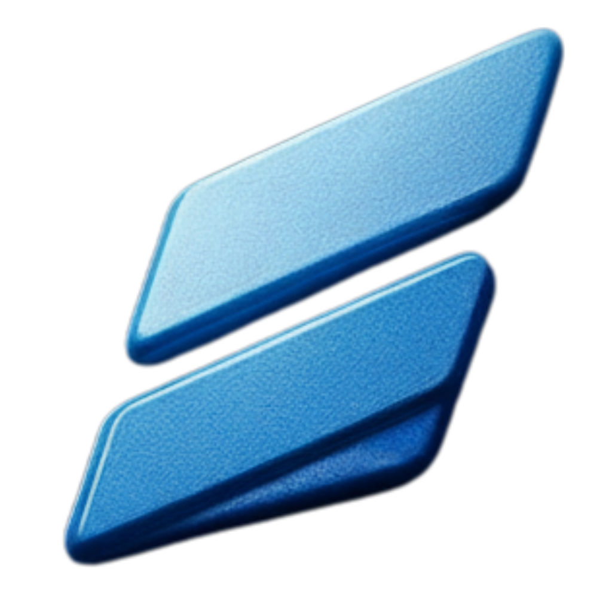

# 🚀 Wosch Software

### Sua Equipe de Programadores

**Desenvolvimento de software personalizado**  
*Arquitetura sólida, código limpo e evolução contínua*

---

## 📋 Sobre a Empresa

A **Wosch Software** é uma empresa especializada em **desenvolvimento de software personalizado** e **equipe de desenvolvimento dedicada** para empresas que precisam de tecnologia confiável, contínua e sob medida.

### 🎯 Nossa Missão

Não desenvolvemos apenas sistemas. **Assumimos a responsabilidade técnica completa pelo seu software**, cuidando da evolução, manutenção, integrações e melhorias constantes, como parceiros em desenvolvimento.

### 💡 Nossos Valores

- ✅ **Arquitetura pensada para longo prazo**
- ✅ **Código limpo e documentado**
- ✅ **Integrações seguras**
- ✅ **Evolução contínua baseada nas necessidades do negócio**
- ✅ **Empresa estabelecida e confiável**

---

## 🛠️ Serviços Oferecidos

### 🎯 Principais Serviços

| Serviço | Descrição |
|---------|-----------|
| 🤖 **CRM Personalizado** | CRMs desenvolvidos sob medida para organizar vendas, processos e relacionamento com clientes |
| 💬 **Chatbots Inteligentes** | Soluções de automação de atendimento com IA para melhorar a experiência do cliente |
| 🛒 **E-commerce Completo** | Lojas virtuais robustas e escaláveis com foco em performance, segurança e conversão |
| 🌐 **Sites e Websites** | Desenvolvimento web moderno e responsivo |
| 🔌 **Integrações** | Conectamos seu sistema com APIs, plataformas e ferramentas existentes |
| 📊 **Dashboards** | Visualização de dados e relatórios inteligentes |
| 🧠 **Inteligência Artificial** | Soluções com IA e Machine Learning |
| 📢 **Tráfego Pago** | Facebook Ads, Google Ads e Meta Ads para gerar leads e vendas |

### 🔧 Serviços Complementares

- **Consultoria de Desenvolvimento** - Orientações estratégicas para escolher as melhores tecnologias
- **Manutenção Preventiva** - Monitoramento proativo e atualizações de segurança
- **Suporte Técnico Dedicado** - Suporte contínuo sempre que precisar

---

## 💼 Por que Escolher a Wosch Software?

### ✨ Diferenciais

| 🚀 Agilidade | 👥 Equipe Dedicada | 🏢 Empresa Confiável |
|--------------|-------------------|----------------------|
| Contrate apenas o que precisa, quando precisa | Profissionais focados exclusivamente no seu sistema | Empresa estabelecida, comprometida e responsável |

| 🎓 Especialização | 🔄 Evolução Contínua | 💰 Redução de Custos |
|-------------------|---------------------|----------------------|
| Acesso a profissionais experientes | Seu sistema evolui junto com seu negócio | Economize com recrutamento e infraestrutura |

### 🎯 Nossa Metodologia

1. **📊 Análise** - Entendemos profundamente seu negócio
2. **🏗️ Arquitetura** - Planejamos a melhor solução técnica
3. **💻 Desenvolvimento** - Código limpo e documentado
4. **🔗 Integração** - Conectamos com sistemas existentes
5. **🚀 Evolução** - Melhorias contínuas baseadas em necessidades

---

## 🛠️ Tecnologias e Ferramentas

### Frontend

### Animações e Efeitos

### Backend & Banco de Dados

### Ferramentas de Desenvolvimento

---

## 📞 Contato

### Entre em contato conosco!

[%2099899--8431-25D366?style=for-the-badge&logo=whatsapp&logoColor=white)](https://wa.me/5541998998431?text=Ol%C3%A1%2C%20tudo%20bem%3F%20Estava%20dando%20uma%20olhada%20no%20seu%20site%2C%20gostaria%20de%20saber%20mais%20sobre)

📍 **Localização:** Curitiba, PR - Brasil

---

## 🌟 Nossos Compromissos

### 🎯 O que você recebe ao trabalhar conosco:

| ✅ | **Desenvolvimento Contínuo** | Evolução baseada nas necessidades do negócio |
|---|-------------------------------|----------------------------------------------|
| ✅ | **Integrações Seguras** | Conectamos com APIs e plataformas existentes |
| ✅ | **Suporte e Manutenção** | Monitoramento proativo e suporte técnico dedicado |
| ✅ | **Código Limpo** | Arquitetura pensada para longo prazo |
| ✅ | **Documentação** | Código documentado e processos claros |

---

## 📈 Resultados e Benefícios

### 💡 Benefícios de Fechar Conosco

- 🚀 **Agilidade e Flexibilidade** - Escalabilidade total conforme sua demanda
- 👥 **Equipe Dedicada** - Profissionais focados exclusivamente no seu sistema
- 🏢 **Empresa Confiável** - Sem risco de desenvolvedores sumirem ou não entregarem
- 🎓 **Especialização** - Acesso a profissionais experientes
- 🔄 **Evolução Contínua** - Seu sistema evolui junto com seu negócio
- 💰 **Redução de Custos** - Economize com recrutamento e infraestrutura

---

## 🚀 Comece Agora

### Pronto para ter uma Equipe de Desenvolvimento Dedicada?

**Vamos analisar seu projeto e definir a melhor estratégia técnica.**

*Arquitetura, tecnologias e metodologia alinhadas às necessidades do seu negócio.*

---

### 📄 Licença

Este projeto é propriedade da **Wosch Software**.

---

**Desenvolvido com ❤️ pela equipe Wosch Software**

© 2025 Wosch Software. Todos os direitos reservados.

